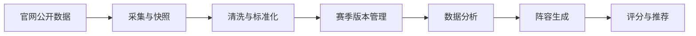

# JCC

金铲铲之战数据采集与阵容分析项目。

项目计划从金铲铲之战官方公开页面获取英雄、羁绊、装备等基础数据，对不同赛季的数据进行清洗、版本化和分析，并在此基础上生成可用的阵容方案。

> 数据采集应遵守官网使用条款、Robots 协议及合理的访问频率，不绕过登录、验证码或其他访问限制。

## 当前数据

已完成第一版 Python 采集器，并于 2026-07-22 从官网当前默认资料库生成 SQLite 数据库：

- 模式：`mode 8`
- 赛季：`S18` 怪兽入侵
- 数据版本：`17.17.7`
- 英雄：63
- 羁绊：27
- 英雄与羁绊关系：136
- 装备：148
- 强化符文：322
- 本地英雄头像：63
- 本地 1624×750 英雄原画：63

数据库位于 `data/jcc.db`，官网原始快照位于 `data/raw/mode8_S18_17.17.7/`。二者均为可再生数据，已加入 `.gitignore`。

## 核心流程



## 功能规划

- 官网数据采集：获取英雄、技能、费用、羁绊、装备和强化符文等公开信息。
- 数据标准化：统一名称、字段、图片地址和实体之间的关联关系。
- 赛季更新：保存原始快照，识别新增、删除和数值变化，支持历史赛季回溯。
- 数据分析：统计费用曲线、羁绊组合、英雄关系及阵容构成。
- 阵容生成：根据羁绊、人口、费用、核心英雄和装备约束生成候选阵容。
- 阵容评分：从羁绊完整度、成型难度、经济成本和装备适配等维度排序。

## 项目目录

```text
jcc/
├── README.md
├── pyproject.toml        # Python 项目及命令行入口
├── start.sh              # 一键启动阵容模拟器
├── data/
│   ├── assets/          # 按赛季版本保存的头像与横版英雄原画
│   ├── raw/             # 官网原始快照
│   └── jcc.db            # SQLite 数据库
├── src/
│   └── jcc/
│       ├── collector.py # 官网版本识别、采集、清洗和快照
│       ├── database.py  # SQLite 表结构与入库
│       ├── cli.py       # 命令行入口
│       └── web/         # 阵容模拟器
│           ├── server.py    # 标准库 HTTP 服务、赛季数据与阵容存档接口
│           └── static/      # 液态玻璃前端页面
└── tests/               # 标准库单元测试
```

## 使用方法

无需安装第三方运行依赖，要求 Python 3.11 或更高版本。

```bash
# 获取官网当前默认赛季的英雄、羁绊、装备和强化符文并更新数据库
PYTHONPATH=src python -m jcc.cli

# 指定模式、赛季或版本
PYTHONPATH=src python -m jcc.cli --mode 8 --season S18 --version 17.17.7

# 只更新结构化数据，明确跳过图片下载
PYTHONPATH=src python -m jcc.cli --skip-images

# 运行离线测试
PYTHONPATH=src python -m unittest discover -s tests -v
```

采集命令会依次读取官网基础配置、版本索引、英雄、羁绊、装备与强化符文数据，并下载两类图片：头像保存在 `data/assets/heroes/<赛季版本>/`，官网英雄页使用的 1624×750 横版原画保存在其 `full/` 子目录。已存在且校验有效的图片会直接复用。官网提前发布但尚未到生效日期的版本不会被误选；重复执行同一版本时会在事务内刷新该版本数据，不会产生重复记录。所有响应都会保存在对应版本的原始快照目录中。

也可以安装为本地命令：

```bash
python -m venv .venv
source .venv/bin/activate
python -m pip install -e .
jcc
```

## 赛季更新

新赛季上线或版本调整后，执行同一条命令即可，无需改代码：

```bash
PYTHONPATH=src python -m jcc.cli
```

采集器不硬编码赛季：先读官网 `basicConfig.js` 取当前 `mode` 与赛季，再读版本索引，选出**当前日期已生效的最新版本**，官网提前发布但未到 `version_start_time` 的版本不会被误选。

> `./start.sh` 不会主动追新版本，它只在数据库缺失或缺少字段时才触发采集。要更新数据必须显式运行上面的命令。

常用变体：

| 场景 | 命令 |
| --- | --- |
| 只更新结构化数据，不重新下载图片 | `python -m jcc.cli --skip-images` |
| 抢先采集官网已发布但未生效的版本 | `python -m jcc.cli --version 18.1.3` |
| 回溯重采指定赛季版本 | `python -m jcc.cli --season S18 --version 17.17.7` |
| 采集其他玩法模式 | `python -m jcc.cli --mode 8` |

更新后的行为：

- 数据按 `season_id` 隔离，旧赛季记录保留；同版本重复采集在事务内幂等刷新，不产生重复记录。
- 原始快照与图片按 `mode<模式>_<赛季>_<版本>` 分目录存放，新旧赛季互不覆盖。
- 前端 `/api/season` 返回 `version_start_time` 最新的赛季，刷新页面即为新数据；接口的 `seasons` 字段已包含全部赛季，但页面暂无切换赛季的入口。

更新失败或数据异常时的排查顺序：

1. 采集失败不会写入半份数据，数据库中的现有数据保持可用。解析结果低于最低合理数量，或同版本刷新时任一实体数量骤降 30% 以上，都会拒绝写库。
2. 若报错或数量明显异常，通常是官网字段结构变化，需要检查 `collector.py` 中的 `transform_heroes`、`transform_traits`、`transform_equipment`、`transform_augments`，`data/raw/` 下的快照即排查依据。
3. 新赛季若引入新的羁绊配色（`color` 超出 1–5）或新的装备类型，前端筛选与徽章按数据动态生成，但配色变量只定义到 `--tier5`，需要在 `styles.css` 补充对应色值。

## 阵容模拟器

一键启动（自动选择 Python 3.11+、必要时先采集数据、再打开浏览器）：

```bash
./start.sh
```

常用参数：`./start.sh --port 9000`、`./start.sh --no-open`、`./start.sh --db /path/to/jcc.db`；
需要指定解释器时用 `PYTHON=/path/to/python ./start.sh`。

也可以手动启动：

```bash
PYTHONPATH=src python -m jcc.web.server --open
# 或安装后
jcc-web --open
```

默认监听 `http://127.0.0.1:8787`，可用 `--db`、`--host`、`--port` 调整。页面特性：

- 液态玻璃 UI，数据与英雄图片从本地读取（装备图标仍走官网 CDN，官网未提供本地缓存）。
- 左栏分「英雄池」「装备库」两个标签：装备按类型筛选、按名称 / 属性 / 效果搜索，右键看合成组件与完整说明。
- 阵容里左键点选英雄进入配装状态，在装备库点击即装上（每人 3 件），装备条上点图标可取下；右键把英雄移出阵容。
- 转职纹章按 `fetter_id` 追加羁绊并计入羁绊统计；「装备基础属性」汇总全队 `basicDesc` 的属性加成。
- 「阵容站位」为 4×7 交错六边形棋盘：从阵容格拖动英雄落座，格子之间拖动即互换位置，双击请下场。
- 英雄卡、棋盘槽位、推荐列表和详情浮层统一使用 `data/assets/heroes/<赛季版本>/full/` 下的 1624×750 横版原画，由 CSS `object-fit: cover` 裁切；裁切焦点由 `styles.css` 的 `--art-pos` 变量统一控制（默认 `72% 30%`）。
- 英雄池支持费用、羁绊、关键词（英雄名 / 羁绊 / 技能描述）组合筛选。
- 点击英雄加入或移出阵容，右键查看技能与成长数值；人口可在 1–12 之间调整。
- 实时计算羁绊人数与激活档位，按青铜 / 白银 / 黄金 / 棱彩配色区分，点击可查看各档效果与全部持有英雄。
- 「推荐补强」列出加入后能立即推进羁绊档位的英雄，按推进档位数和费用排序。
- 阵容、配装与站位一起写入 URL hash（`h` 英雄、`i` 装备、`p` 站位），刷新页面可恢复，浏览器前进后退可切换阵容。
- 顶栏「我的阵容」打开右侧抽屉（遮罩、✕ 或 ESC 关闭，按钮上带存档数量），把当前英雄、装备、站位与人口整套存入数据库：填名字保存为新阵容，列表里可载入、覆盖、改名、删除（删除有二次确认），载入后自动收起抽屉。存档按 `season_id` 隔离，只列出当前赛季，同赛季内不允许重名。

后端接口：

| 方法与路径 | 说明 |
| --- | --- |
| `GET /api/season` | 当前赛季的英雄、羁绊、装备及关联关系（装备的 `fetter_id` 已换算成 `trait_id`） |
| `GET /api/compositions` | 列出当前赛季的阵容存档，按更新时间倒序 |
| `POST /api/compositions` | 新建存档，body 为 `{name, note?, board_size, board, items, positions}` |
| `PUT /api/compositions/{id}` | 修改存档：只传 `name`/`note` 即为改名，带 `board_size` 则连同阵容内容一起覆盖 |
| `DELETE /api/compositions/{id}` | 删除存档 |

写接口都接受可选的 `?season_id=`，默认作用于当前赛季。服务端会校验英雄 id 与装备 key 属于该赛季、每人最多 3 件装备、站位格在 0–27 且一人一格；重名返回 409，数据非法返回 400，跨赛季或不存在返回 404。

## 数据库

主要数据表：

- `seasons`：模式、赛季、版本、来源地址、采集时间及内容哈希。
- `heroes`：英雄基础资料、技能、头像与横版原画的官网地址和本地路径、各星级属性及官网原始数据。
- `traits`：种族/职业羁绊、激活档位、效果及官网原始数据。
- `hero_traits`：英雄与羁绊的多对多关系。
- `equipment`：装备分类、描述、图片、合成组件和关联羁绊。
- `augments`：强化符文等级、效果、图标、英雄强化类型和关联羁绊。
- `compositions`：用户保存的阵容存档，含名称、备注、人口和 `payload_json`（英雄、装备、站位），按 `season_id` 隔离且同赛季名称唯一。

查询示例：

```sql
SELECT h.name, h.cost, GROUP_CONCAT(t.name, ' / ') AS traits
FROM heroes AS h
JOIN hero_traits AS ht ON ht.hero_id = h.id
JOIN traits AS t ON t.id = ht.trait_id
GROUP BY h.id
ORDER BY h.cost, h.name;
```

## 数据模型草案

首期建议至少包含以下实体：

- `Season`：赛季标识、名称、版本、开始时间及数据更新时间。
- `Champion`：英雄名称、费用、属性、技能、所属羁绊及图片。
- `Trait`：羁绊名称、档位要求和各档效果。
- `Item`：装备名称、合成关系、属性及效果。
- `Lineup`：英雄集合、激活羁绊、核心英雄、推荐装备和综合评分。

所有业务数据都应携带赛季或版本标识，避免不同赛季的数据相互污染。

## 首期里程碑

1. 确认官网公开数据入口及字段范围。
2. 完成单赛季英雄与羁绊数据采集，并保留原始响应。
3. 建立标准数据模型、数据校验和持久化方案。
4. 实现赛季数据差异比较与增量更新。
5. 实现基于人口和羁绊约束的基础阵容生成器。
6. 增加测试、日志、失败重试和数据质量报告。

## 开发状态

- [x] 初始化 Git 仓库
- [x] 创建项目说明
- [x] 确定 Python 技术栈与项目结构
- [x] 调研并确认首个官方数据源
- [x] 实现英雄、羁绊、装备与强化符文采集器
- [x] 建立 SQLite 数据库和赛季版本表
- [x] 实现英雄浏览与羁绊搭配的阵容模拟页面
- [x] 支持阵容存档的保存、载入、修改与删除
- [ ] 实现数据分析与阵容自动生成

## 说明

本项目为数据研究与学习用途，与腾讯、金铲铲之战官方无隶属或合作关系。游戏名称及相关素材的权利归其各自权利人所有。
